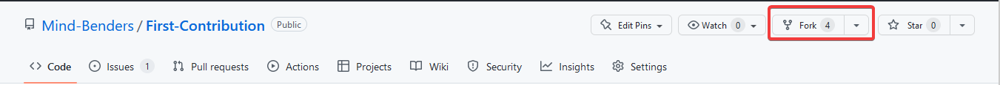
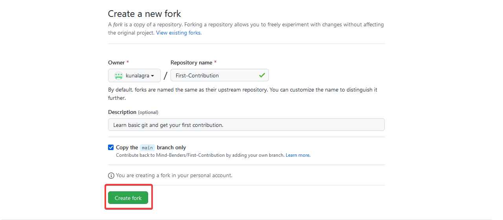
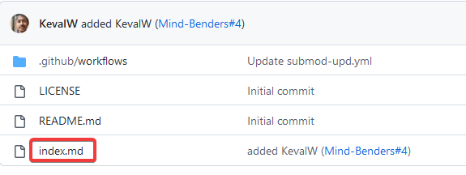
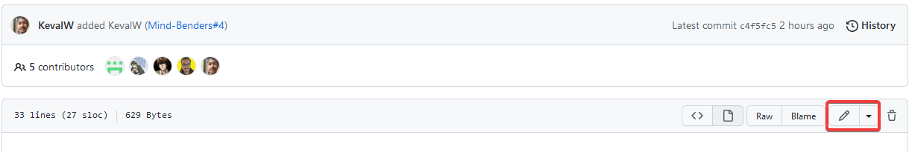
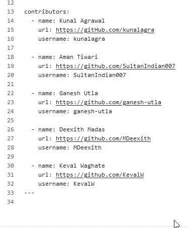
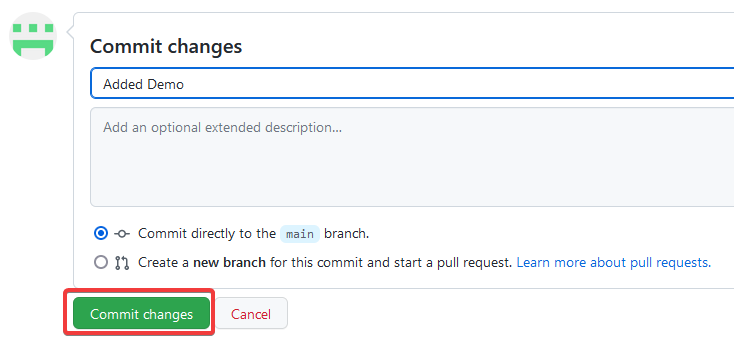
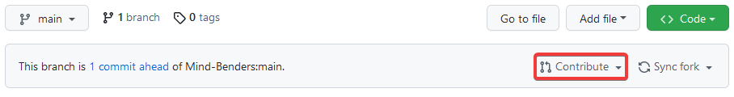
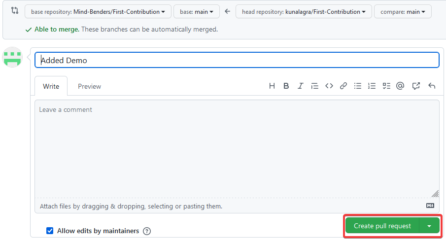

# First-Contribution

Hi, Let's get started with our very first open-source contribution by following some very easy steps.

You will be adding your name and GitHub Profile Link to this repository for your first open-source contribution

# How to Contribute to this Project?

## Fork This Project

Fork this repo by clicking on the fork button on the top right of this page. This will create a copy of this repository in your account.

On the next page, click on the `Create fork` button. You may change details as you see fit.

## Edit the File

Once your fork is completed, open `index.md` file on your repository.

Next edit this file on your browser by clicking the edit button on top right.

Now, under contributors, add your Name & GitHub username.

**Don't add it at the beginning or end of the file. Put it anywhere in between.**

Now to save the file, commit the changes by adding relevant commit message and click on `Commit changes`

## Create a Pull Request

Now that your have made changes to your copy, it's time to submit these changes to the Original Repository.

Head back to your repository and click on `Contribute` Button.

Next click on the Green Button that says, `Open pull request`

Fill in the details as you feel necessary and click `Create pull request`

Soon we'll be merging all your changes into the main branch of this project. You will get a notification email once the changes have been merged.

## Next Steps

Congrats! You just completed the standard fork -> clone -> edit -> pull request workflow that you'll often encounter as a contributor!

You are ready to start contributing to open-source. We've compiled a list of projects with easy issues you can get started on. Check out the [list of projects compiled by First Contributions](https://firstcontributions.github.io/#project-list).

## Credits

[First Contributions](https://github.com/firstcontributions/first-contributions)
